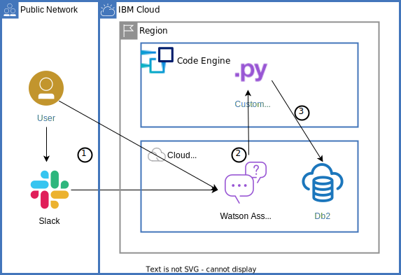

**Note:**   
Code and instructions relating to the previous version of the tutorial [Build a database-driven Slackbot](https://cloud.ibm.com/docs/solution-tutorials?topic=solution-tutorials-slack-chatbot-database-watson) are located in the [branch **cloud-functions**](https://github.com/IBM-Cloud/slack-chatbot-database-watson/tree/cloud-functions).


# Build a database-driven Slackbot with IBM Watson Assistant

This repository contains the code for IBM Cloud solution tutorial [Build a database-driven Slackbot](https://cloud.ibm.com/docs/solution-tutorials?topic=solution-tutorials-slack-chatbot-database-watson). It uses IBM Watson Assistant to create a chatbot and link it to Slack for a "Slackbot". By integrating a custom extension into the assistant, the chatbot can reach out to a Db2 on Cloud database. The custom extension is a Python app which provides a REST API for database objects. The chatbot can retrieve and insert data by calling these API functions. The Python app is deployed to IBM Code Engine.



# Run and test locally

The app was tested with Python 3.10. You can either run the app directly or first build, then run it as container.
Direct: 
1. Install the required modules as specified in [requirements.txt](requirements.txt).
2. Edit **.env** to configure the database connection and a secret token / API key.
3. Run `python3 app.py`

Use the **podman** or **docker** tool to build and run the container.
1. `docker build -t slackbot:2 .`
2. Edit **.env** to configure the database connection and a secret token / API key.
3. `docker run -p 8080:8080 --env-file .env slackbot:2`

The file [.env.sample](.env.sample) shows a sample configuration:
- DB2_URI: Has the SQLAlchemy URL to the Db2 database
- API_TOKEN: Is the secret for the API key authentication.
- TABLE_ARGS: Is an optional setting to specify a different table schema. The EVENTS table is created in the default schema for the connection. This can be overwritten.


If you stored the Db2 credentials in a file **slackbotkey.json**, then use **jq** to create the URL using this command:
```
cat slackbotkey.json | jq '.[].credentials.connection.db2 | (.authentication.username + ":" + .authentication.password + "@" + .hosts[0].hostname + ":" + (.hosts[0].port | tostring) + "/" + .database + "?Security=SSL")'
```
The output follows this schema `db2+ibm_db://user:password@hostname.databases.appdomain.cloud:port/bludb?Security=SSL;`.

Create or recreate the database objects by calling the following API. Adapt the host, port, and API key as necessary.
```
curl -X 'POST'  'http://127.0.0.1:5000/database/recreate?confirmation=True' -H 'accept: application/json' -H 'API_TOKEN: MY_SECRET'
```

# OpenAPI Specification
The Python app is based on the [APIFlask](https://apiflask.com/) API framework which itself is based on Flask. [The OpenAPI specification for the application can be (re-)generated using](https://apiflask.com/openapi/):
```
flask spec --output slackbot-openapi-spec.json
```

You can also access the running app at the `/docs` (Swagger UI) and `/redoc` (Redoc) endpoints for interactive API documentation. See the [APIFlask documentation on Swagger UI and Redoc](https://apiflask.com/api-docs/) for details.


## License

See [License.txt](License.txt) for license information.
